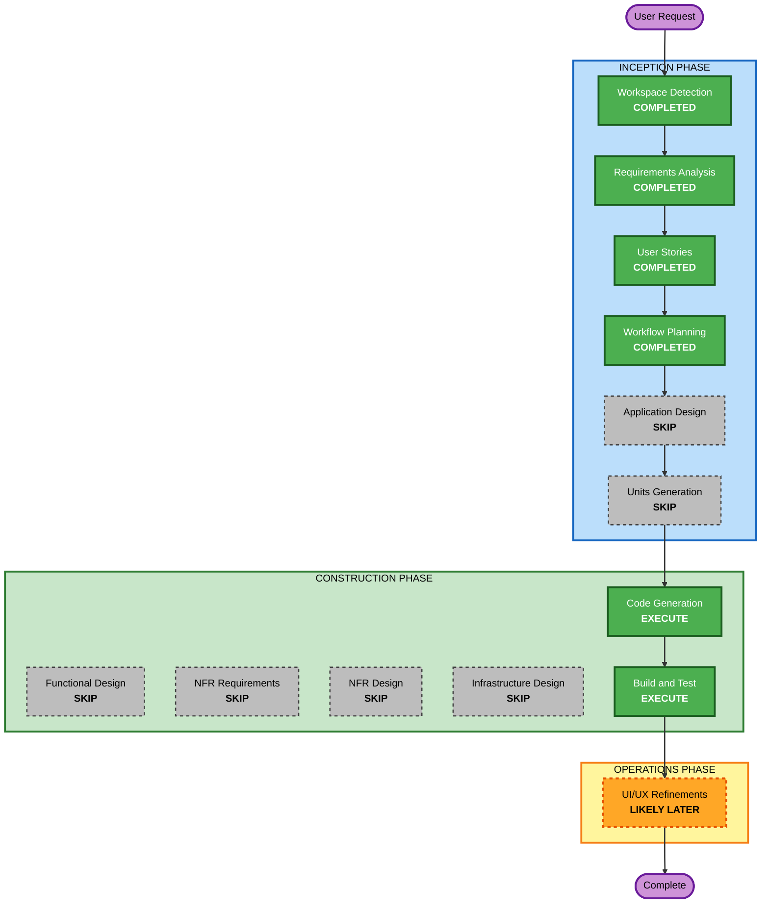

# Execution Plan — Zion Kidd Personal Portfolio Site

## Detailed Analysis Summary

### Change Impact Assessment
- **User-facing changes**: Yes — the entire deliverable is user-facing (home page, case studies, teaser page, resume/blog/analytics/dark-mode extras).
- **Structural changes**: N/A (greenfield — there is no prior structure to change).
- **Data model changes**: Minimal — per-project case-study content will live as typed data objects/files (name, summary, problem, target user, competitors, insight, solution, tech stack, links, optional bonus fields), not a database schema.
- **API changes**: None — static site, no backend API beyond the site itself.
- **NFR impact**: Low — no security/resiliency posture beyond static-hosting defaults; a few small implementation choices remain (analytics provider, GitHub Pages SPA routing technique) but don't warrant a dedicated NFR stage (see rationale below).

### Risk Assessment
- **Risk Level**: Low — single-owner static site, no production users yet, trivially reversible (it's a git repo; nothing is destructive).
- **Rollback Complexity**: Easy — revert a commit / redeploy.
- **Testing Complexity**: Simple — component rendering + a build check; no complex business logic to unit test per the PBT extension decision (disabled).

## Workflow Visualization



### Text Alternative
```
Phase 1: INCEPTION
- Workspace Detection (COMPLETED)
- Requirements Analysis (COMPLETED)
- User Stories (COMPLETED)
- Workflow Planning (COMPLETED - this document)
- Application Design (SKIP)
- Units Generation (SKIP)

Phase 2: CONSTRUCTION
- Functional Design (SKIP)
- NFR Requirements (SKIP)
- NFR Design (SKIP)
- Infrastructure Design (SKIP)
- Code Generation (EXECUTE)
- Build and Test (EXECUTE)

Phase 3: OPERATIONS
- UI/UX Refinements (likely later, once functional MVP exists)
```

## Phases to Execute

### INCEPTION PHASE
- [x] Workspace Detection (COMPLETED)
- [x] Requirements Analysis (COMPLETED)
- [x] User Stories (COMPLETED — user explicitly requested inclusion)
- [x] Execution Plan (this document)
- [ ] Application Design — **SKIP**
  - **Rationale**: No new services, no complex component dependency graph, no business-rule-bearing methods to define. The components needed (Header/Nav, ProjectCard, CaseStudyLayout, TeaserPage, DarkModeToggle, design-token theme) are self-evident from requirements + stories and are cleanly enumerable directly in the Code Generation plan without a separate design pass.
- [ ] Units Generation — **SKIP**
  - **Rationale**: This is a single simple unit — one cohesive static site. No independent packages/services that need parallel-workstream decomposition.

### CONSTRUCTION PHASE
- [ ] Functional Design — **SKIP**
  - **Rationale**: No complex business logic or data transformations. Case-study content is static typed data (per FR-2/NFR-4 in requirements.md), not computed/derived business rules.
- [ ] NFR Requirements — **SKIP**
  - **Rationale**: Core tech stack (React + Vite, GitHub Pages, React Router) is already locked in requirements.md. The remaining implementation-level choices (which analytics library, exact GH-Pages SPA-routing technique, blog post format) are low-risk, easily-changed decisions appropriate to make directly in Code Generation planning rather than a separate approval-gated stage. All three extensions (Security/Resiliency/PBT) are already confirmed disabled.
- [ ] NFR Design — **SKIP**
  - **Rationale**: Depends on NFR Requirements, which is skipped for the same reason.
- [ ] Infrastructure Design — **SKIP**
  - **Rationale**: GitHub Pages + GitHub Actions is a standard, well-documented static-hosting path with no cloud resources to design/map.
- [x] Code Generation — **EXECUTE (ALWAYS)**
  - **Rationale**: Implementation planning and code generation needed — this is the actual build.
- [x] Build and Test — **EXECUTE (ALWAYS)**
  - **Rationale**: Build verification (production build succeeds, deploys to GH Pages, all routes resolve including the SPA-routing edge case) and testing needed.

### OPERATIONS PHASE
- [ ] UI/UX Refinements — **Likely, once a functional MVP exists**
  - **Rationale**: The design system in requirements.md (FR-5) will be implemented directly during Code Generation so the MVP doesn't look like a generic placeholder theme. This Operations stage remains available afterward for pixel-level refinement, additional reference-image-driven polish, or once the author supplies a real photo/bio/resume.
- [ ] Deployment / Monitoring / Maintenance — **PLACEHOLDER** (template stages, not applicable at this scale)

## Estimated Timeline
- **Total Stages Executing**: 6 (Workspace Detection, Requirements Analysis, User Stories, Workflow Planning, Code Generation, Build and Test)
- **Stages Skipped**: 6 (Application Design, Units Generation, Functional Design, NFR Requirements, NFR Design, Infrastructure Design) — each with rationale above
- **Estimated Duration**: Single Code Generation pass (one unit, no per-unit loop needed) followed by build verification.

## Success Criteria
- **Primary Goal**: A working, deployed React + Vite portfolio site on GitHub Pages satisfying all 13 user stories.
- **Key Deliverables**:
  - Home page with author intro (placeholder bio) + project grid (2 full cards + 1 Coming Soon card)
  - Vine to Wine case study page (content sourced from `zrkidd-pixel/Vine_to_Wine`)
  - my-fitness-app case study page (content sourced from `zrkidd-pixel/my-fitness-app`)
  - Wine society logo rebrand teaser page
  - Reusable case-study layout/template (US-8)
  - Centralized content/config for editable fields (US-9)
  - Dark mode toggle (system-default, both themes polished)
  - Resume download button (placeholder file state)
  - Minimal blog/writing section
  - Lightweight pageview analytics
  - GitHub Actions deployment to GitHub Pages
- **Quality Gates**: Production build succeeds; all routes (including direct-linked case-study/teaser routes and GH Pages SPA refresh behavior) resolve correctly; light/dark themes both render correctly; no broken links (resume/live-demo placeholders degrade gracefully per US-4/US-11).
